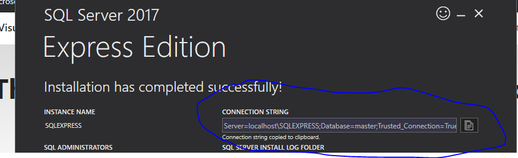
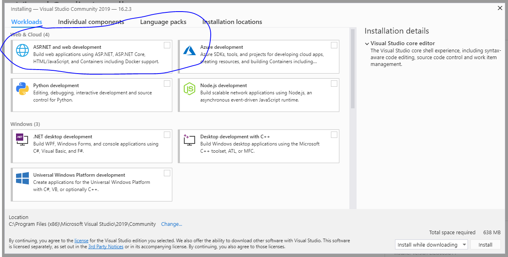
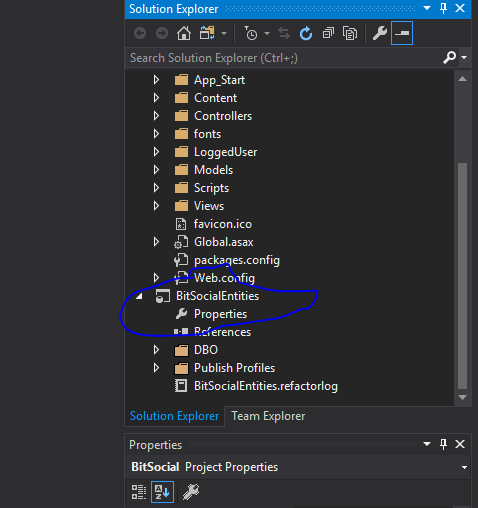
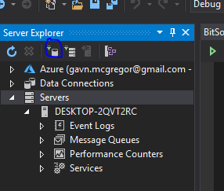
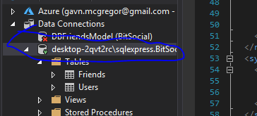
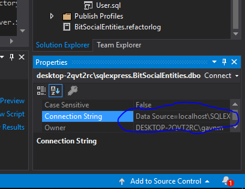
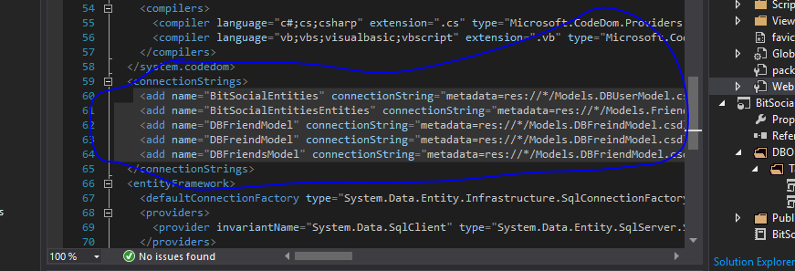

 
 <h1>BitSocial Installation Guide</h1>
<p>There are a couple of things we are going to need to download first.</p>
<ul>
<li>Visual Studios</li>
<li>Sql Server</li>
</ul>
<hr/>
<h2>1) SQL download and install</h2>
<ol>
<li>Download Sql express</li>
<ul>
<li>You can download Sql express from the following link https://www.microsoft.com/en-us/sql-server/sql-server-editions-express.</li>
<li>When the link is opened you will be taken to the microsoft website with a download link, click on the download button.</li>

<li>After the SQLServer2017-ssel-Expr.exe file is downloaded, run the file.</li>
<li> It will prompt you with a window to select an installation type select: Basic. Then Accept the Terms and Conditions.</li>
<li>The next window will prompt you with an option to select a location for the files to be installed, select a location, and click Install.</li>
<li>The packages will now download.</li>
<li>Once you have completed the installation, a window will show saying: Installation has completed successfully!</li>
<li>beneath the success message you will see a Connection String text box, copy that string. Open up a new .txt file and past the connection string in the .txt file.</li>

</ul>
</ol>
<h2>Download the Visual studio project form GitHub</h2>
<ul>
<li>Go to the following link and download the BitSocial file from the git repository, by clicking on the clone or download button,
 and then click on the download zip button. Your download will start shortly.
</li>
<li>Unzip the folder to your desired location.</li> 
</ul>
<h2>Installing Visual Studio</h2>
<ol>
<li>Download Visual Studio</li>
<ul>
<li>you can download visual studio community from the following link: https://visualstudio.microsoft.com/vs/community/<li/>
<li>Click on the "Download Visual Studio" Button, your download will start shortly</li>
<li>Once the dowload has completed open up the vs_community.exe, and click continue.</li>
<li>Visual Studio Installer will open, There will be an option to install Visual studio Comminity 2019, click on the install button.</li>
 
<li>A workloads page will open, select the ASP.NET and web development box, and then click the install button on the bottom right.</li>
 
<li>The Download and installation process will start.</li>
<li>Once the download is complete visual studio will open up</li>
<li> If you do not have a Microsoft account you will have to make one, if you already have an account sign in</li>
<li>Open up visual studio, on the top left of the screen click - file - open - project or solution, navigate to the BitSocial file you downloaded from GitHub, open the folder and select the BitSocial.sln file.</li>
<li>Once the project has opened navigate to the BitSocialEntities Project, right click on it and select publish.</li>
 
<li>This will open up a wiondow that will allow you do publich the database, by target database connection click edit.</li>
<li> Another window will open, in the top of the window click browse, them click the local dropdown list.you will your server we created earlier "yourservernamew"/SQLEXPRESS, select that server, and at the bottom of the page fill in the database name as "BitSocialEntities" then click OK.</li>
<li>Click publish database. The database will be published to your local server.</li>
<li>open us the server explorer by clicking on  View at the top of the screen and the Server explorer.</li>
<li>Click on the Connect to database icon, a window will open under DataSource select Microsift SQL Server, then click continue, now go to your text document we created earlier, look weithin the connection string and copy ther server name serction eg."localhost\SQLEXPRESS".</li>
 
<li> select or enter database name will be "BitSocialEntities", then click OK.</li>
<li>This will add the database to your server explorer, click on the server you just created. at the bottom right under the properties pane there is a connection string field, copy the connection string.</li>
 
 
<li>In the solutions explorer navigate to Web.config file, inside this file find the lines with the connectionString tags.</li>
<li>User this line of code by pasting your connectionString in all the places that say "YOUR CONNECTION STRING".</li>

  ```
    <add name="BitSocialEntities" connectionString="metadata=res://*/Models.DBUserModel.csdl|res://*/Models.DBUserModel.ssdl|res://*/Models.DBUserModel.msl;provider=System.Data.SqlClient;provider connection string=&quot;YOUR CONNECTION STRING;Connect Timeout=60;Encrypt=False;TrustServerCertificate=True;ApplicationIntent=ReadWrite;MultiSubnetFailover=False;App=EntityFramework&quot;" providerName="System.Data.EntityClient" />
    <add name="BitSocialEntitiesEntities" connectionString="metadata=res://*/Models.Friends.csdl|res://*/Models.Friends.ssdl|res://*/Models.Friends.msl;provider=System.Data.SqlClient;provider connection string=&quot;YOUR CONNECTION STRING;connect timeout=60;encrypt=False;trustservercertificate=True;application name=EntityFramework;applicationintent=ReadWrite;multisubnetfailover=False;MultipleActiveResultSets=True&quot;" providerName="System.Data.EntityClient" />
    <add name="DBFriendModel" connectionString="metadata=res://*/Models.DBFreindModel.csdl|res://*/Models.DBFreindModel.ssdl|res://*/Models.DBFreindModel.msl;provider=System.Data.SqlClient;provider connection string=&quot;YOUR CONNECTION STRING;multipleactiveresultsets=True;connect timeout=60;encrypt=False;trustservercertificate=True;application name=EntityFramework;applicationintent=ReadWrite;multisubnetfailover=False&quot;" providerName="System.Data.EntityClient" />
    <add name="DBFreindModel" connectionString="metadata=res://*/Models.DBFreindModel.csdl|res://*/Models.DBFreindModel.ssdl|res://*/Models.DBFreindModel.msl;provider=System.Data.SqlClient;provider connection string=&quot;YOUR CONNECTION STRING;multipleactiveresultsets=True;connect timeout=60;encrypt=False;trustservercertificate=True;application name=EntityFramework;applicationintent=ReadWrite;multisubnetfailover=False&quot;" providerName="System.Data.EntityClient" />
    <add name="DBFriendsModel" connectionString="metadata=res://*/Models.DBFriendModel.csdl|res://*/Models.DBFriendModel.ssdl|res://*/Models.DBFriendModel.msl;provider=System.Data.SqlClient;provider connection string=&quot;YOUR CONNECTION STRING;multipleactiveresultsets=True;connect timeout=60;encrypt=False;trustservercertificate=True;application name=EntityFramework;applicationintent=ReadWrite;multisubnetfailover=False&quot;" providerName="System.Data.EntityClient" />
  ```
<li>Past this whole line of code with your connectionString filled where it needs to be and past it inbetween the ConnectionString tags, within the Web.Config folder</li>

</ul>
</ol>

<p>The code is now ready to run and tested</p>

<h2>Joke time:</h2>
<p>What do you call an Irishman with a spade on his head: </p>
<p> Dug</p>
<p>What do you call an Irishman without a spade on his head: </p>
<p> Douglas</p>

